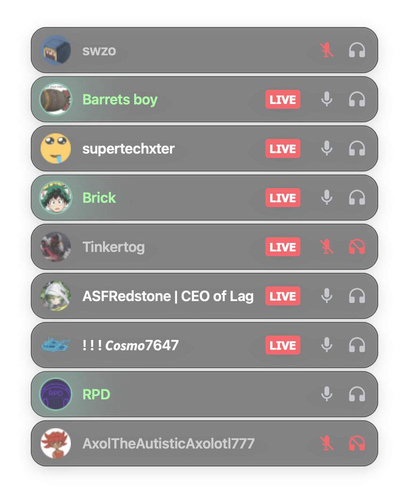
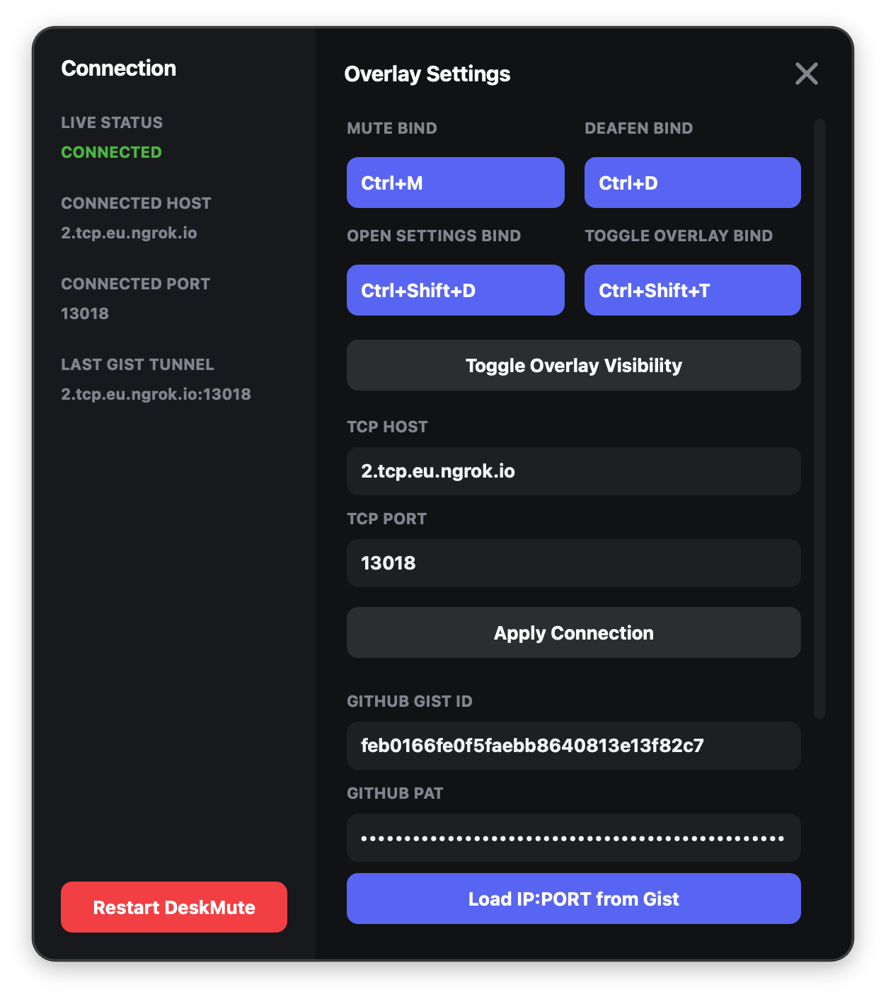

# VoiceOverlay (DeskMute)

This application adds an on-screen overlay and allows you to toggle mute and deafen states on Discord from a secondary device. It is useful for setups where Discord runs on a different machine than the one you are gaming on, enabling you to manage your voice controls via global hotkeys and see active call participants on your main gaming screen.

This project was built to solve a very specific personal problem and likely will not be useful for others.

---

## Screenshots

## Screenshots

| Overlay View | Settings View |
| :---: | :---: |
|  |  |
---

## Requirements

To build and run this project, you need:
- **Qt 6 or higher** 
- **Cmake & a C++ Compiler**
- **Node.js**
- **pnpm**

---

## Vencord Plugin Installation

The overlay communicates via a TCP socket server opened by Discord. This requires a custom Vencord plugin.

1. Clone the Vencord repository.
2. Place the plugin files from the `web` subdirectory into these exact locations within the cloned Vencord directory:
   - `src/plugins/deskMute/index.ts`
   - `src/plugins/deskMute/native.ts`
3. Install the dependencies first:
   ```bash
   pnpm install
   ```
4. Build and inject the plugin into your Discord client:
   ```bash
   pnpm build && pnpm inject
   ```

## Supported Systems
- Built for Windows & Macos but should work for linux in theory tho I have not tested it
